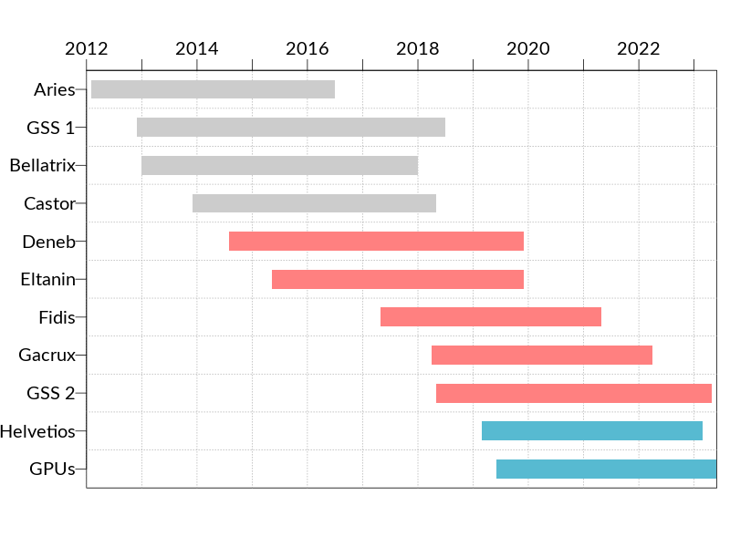
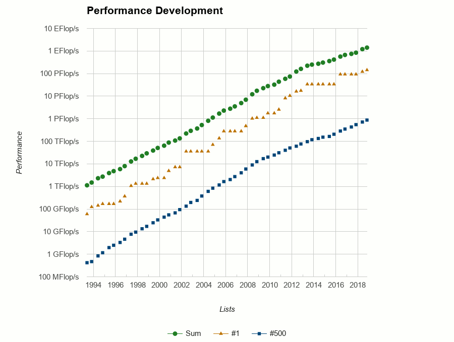
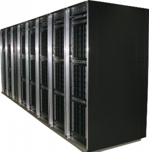
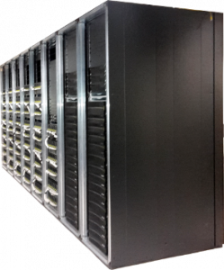
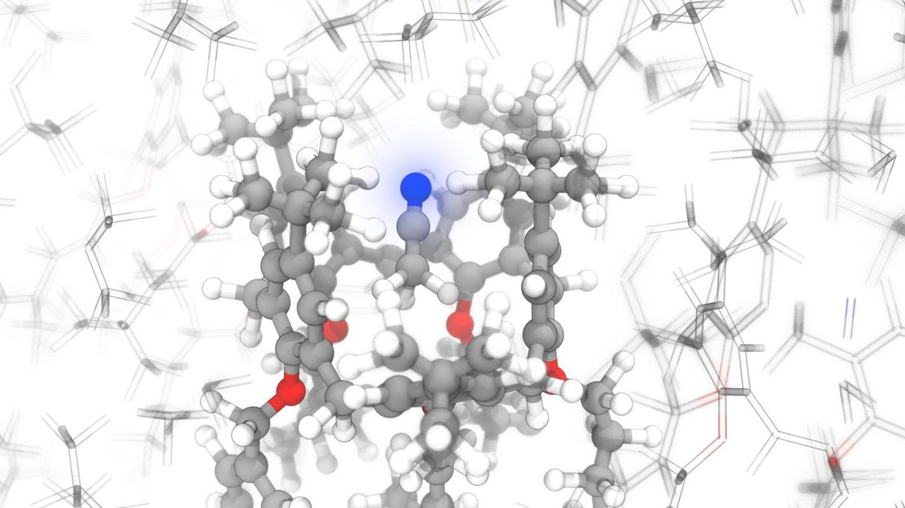
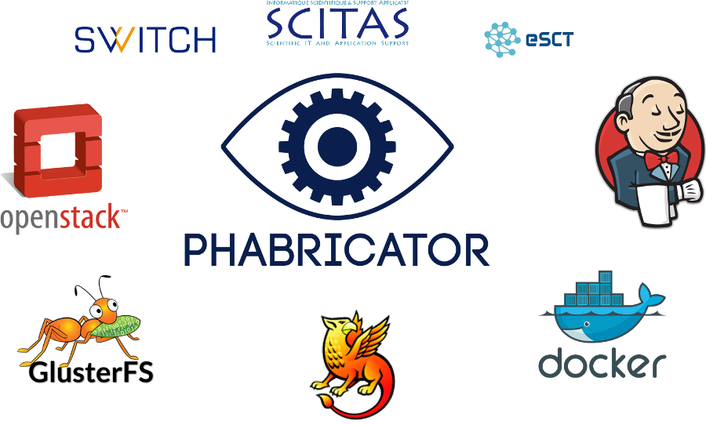
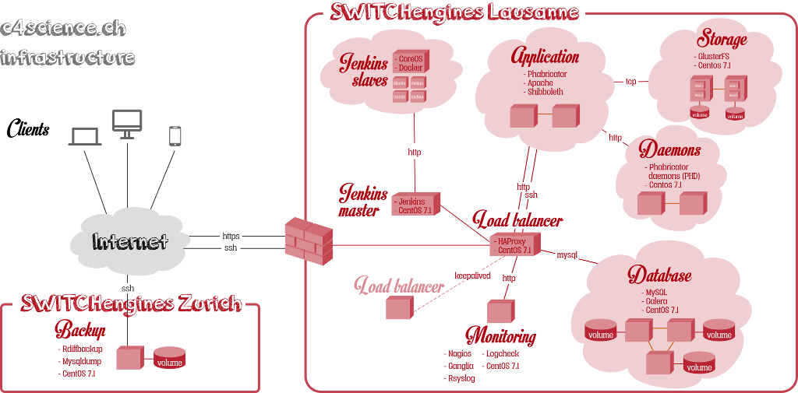

# Nos services
 
 

- Clusters de calcul: ~1000 serveurs et 30'000 cores
- Stockage associé: 7PB
- Expertise applicative

 
 

~670 utilisateurs provenant de 180 laboratoires.

# Nos services moins connus

 
 

- c4science.ch
- Ingénierie logicielle, HPC et support scientifique

# Gouvernance

 
 

- Comité de Direction
- Assemblée générale des utilisateurs
- Direction opérationnelle

# L'équipe

 
 

- 6 experts systèmes (5.8)
- 7 experts applicatifs (6.9)
- 1 assistante administrative (1.0)
- 1 directrice exécutive (0.8)

# Systèmes

- Achat des machines
- Exploitation des machines
- Support utilisateurs
- Cours pour les utilisateurs
- Déploiement logiciels scientifiques
- Veille technologique

<table><tr>
<td></td>
<td></td>
<td></td>
<td></td>
<td></td>
<td></td>
</tr><tr>
<td>Jean-Baptiste Aubort</td>
<td>Christian Clémençon</td>
<td>Jean-Claude De Giorgi</td>
<td>Ricardo Silva</td>
<td>Ewan Roche</td>
<td>Krassimir Todorov</td>
</tr></table>

# Applications

- Support utilisateurs
- Cours pour les utilisateurs
- Cours master/PhD
- Déploiement logiciels scientifiques
- Veille technologique
- Support scientifique

<table><tr>
<td></td>
<td></td>
<td></td>
</tr><tr>
<td>Massimiliano Culpo</td>
<td>Jiannong Fang</td>
<td>Gilles Fourestey</td>
</tr><tr>
<td></td>
<td></td>
<td></td>
<td></td>
</tr><tr>
<td>Daniel Jana</td>
<td>Vincent Keller</td>
<td>Nicolas Richart</td>
<td>Nicola Varini</td>
</tr>
</table>

# Administration

- Gestion des utilisateurs
- Contrats avec les différents groupes
- Achat des machines
- Statistiques utilisateurs
- Facturation

<table><tr>
<td></td>
<td></td>
</tr><tr>
<td>Yohanna Lebet Administrative Assistant</td>
<td>Vittoria Rezzonico Operational Director (80%)</td>
</tr></table>

---

# Nos machines

 

## Clusters HPC

 

- Systèmes orientés calcul à haute performance: HPC
- Quand la taille du problème dépasse 1 noeud
- Système de fichiers parallèle et distribué (GPFS)
- Réseaux basse latence

---

---

# Pour calculer chez nous

  

- demander un compte
- comptes possibles pour externes
    - collaboration avec un labo EPFL
    - contrat avec *externe académique*

# Une fois qu'on a le compte

- faire le *login*
- copier votre code sur la machine
- copier les entrées (ou *git clone*)
- soumettre une tâche
- surveiller l'état de la tâche
- une fois la tâche terminée, copier les résultats

Des cours de base sont organisés régulièrement et sur demande

---

# Durée de vie

   

- la durée de vie d'une machine est généralement de 4 ans
- elle peut être prolongée d'un an, hors garantie
    - si une pièce non-critique lâche, moins de puissance de calcul
    - si une pièce critique lâche,  on décomissionne toute la machine

---

# FLOPs: définition

## Floating Point Operations Per Second

Opérations à virgule flottante par seconde

| Préfixe | Sigle | Valeur  |
|---|---|---|
| k  | kilo | $10^3$   |
| M | méga | $10^6$   |
| G | giga | $10^9$ |
| T | téra | $10^{12}$ |
| P | péta | $10^{15}$ |
| E | exa | $10^{18}$ |

---

# Nos clusters

Aujourd'hui 2 clusters, 4 générations de CPUs

- 1170 noeuds de calcul
    - 27 k coeurs
    - 140 TB de RAM
    - 1.3 PFLOPs (.091 sur des GPUs)
- 7 PB Stockage partagé
    - le plus gros morceaux est pour le stockage moyen terme

# Deneb + Eltanin

- scratch: utilise le GPFS central
- Infiniband QDR

# En bref

  

- Performance crête: 293 TFLOPs
    - 211 dans les CPUs
    - 92 dans les GPUs
- RAM totale: 37TB
- 9920 cores

# Spécifications

- Deneb
    - deux frontales,
    - deux noeuds d'administration
    - 376 noeuds de calcul Ivy Bridge
    - 16 noeuds avec chacun 4 GPUs (NVIDIA K40)
    - 10 noeuds à grande mémoire
- Eltanin
    - 144 noeuds Haswell

# Fidis et Gacrux

# En bref

  

- Performance crête: 978 TFLOPs
- Stockage scratch: 350TB GPFS
- Infiniband FDR
- 17'472 cores
- SSDs locaux (tmp, LROC)

---

## Fidis

- Architecture Intel Broadwell
- deux noeuds d'administration
- 336 noeuds standard
- 72 noeuds à grande mémoire

## Gacrux

- 216 noeuds Intel Skylake
- Infiniband EDR

---

# Nouvel arrivage

 

## Helvetios

 

- cluster standard (pas d'accélérateurs)
- 288 noeuds
- 10'368 cores au total
- puissance crête: 763 TFLOPs
- déjà dans le datacenter, en production sous peu

# Le futur: Izar

  

- Cluster accéléré avec des GPUs
- 32 à 64 noeuds avec 2 cartes NVIDIA V100 chacun
- 2 noeuds avec 4 cartes et NVlink
- puissance crête: 0.5 à 1 PFLOPs

# Science

Exemple de codes qui tournent chez nous

# Frequent flyers

# Frequent flyers

- Science des matériaux
- Chimie computationnelle
- Dynamique des fluides
- Mécanique des solides
- Météo
- Biostatistique
- Sciences du vivant
- Physique des hautes énergies
- Microscopie
- dynamique des structures, tremblements de terre
- Imagerie
- Machine Learning (partout)

# Support applicatif

# Support applicatif

- From scratch to supercomputers: building a large-scale strong lensing computational software bottom-up LASTRO
- Tracing innovation in the market place IIPP
- Laminar-turbulent patterns ECPS
- BrainNets: Extracting Functional Brain Networks from Massive Data Acquisition Initiatives MIP:Lab
- Super-resolution fluorescence microscopy LEB

---

# Environnement

Notre environnement de programmation est entièrement reproductible

## Spack

- système de gestion des paquetages
- instructions de compilation, optimisées pour chaque architecture
- graphe de dépendances entre logiciels et leur versions

# Code

## C4science

### Plateforme de versioning de code

- ouverte à la communauté SwissUniversities
- Git, SVN, Mercurial
- authentication via SwitchAAI
- utilisateurs externes via Google, GitHub, logins locaux
- dimension sociale: wikis, bug trackers, chats

# Code

## C4science

### Intégration continue

  

- définir tests et environnements
- *quand est-ce mon code s'est cassé?*
- surveiller les performances du code

# C4science: architecture sur SwitchEngines

---

## Phabricator

- outil de développement interne de Facebook depuis 2010
- depuis 2014, entreprise dédiée, Phacility Inc
- maintenu activement et utilisé par: Wikimedia, Blender, KDE, Uber, ...

## Jenkins

- intégration continue
- utilisé par SCITAS aussi en interne pour le déploiement des logiciels

# Infrastructure

- Openstack chez SWITCHengines
- authentification Shibboleth chez Switch AAI
- Jenkins via Docker

---

# Retour aux clusters: coûts

# Coûts internes

 
 

- support générique
- amortissement des noeuds de calcul

 

0.0082 CHF le core hour

# Externe académique

 
 

- maintenance par les experts système
- contrats de maintenance avec les fournisseurs
- stockage et réseau

 

0.0187 CHF le core hour

# TCO

 

- électricité et refroidissement
- coût du personnel administratif
- coût du personnel des services centraux
- loyer et fonctionnement

 

0.0230 CHF le core hour

# Visite de la salle machines

## Informations

- ouverte en en 2012
- capacité: 1MW
- entièrement refroidie avec l'eau du lac
- *free cooling*
- et les truites?
- presque pleine... mais on aura une nouvelle salle en 2021
- bruyante (merci Deneb)

--- 

